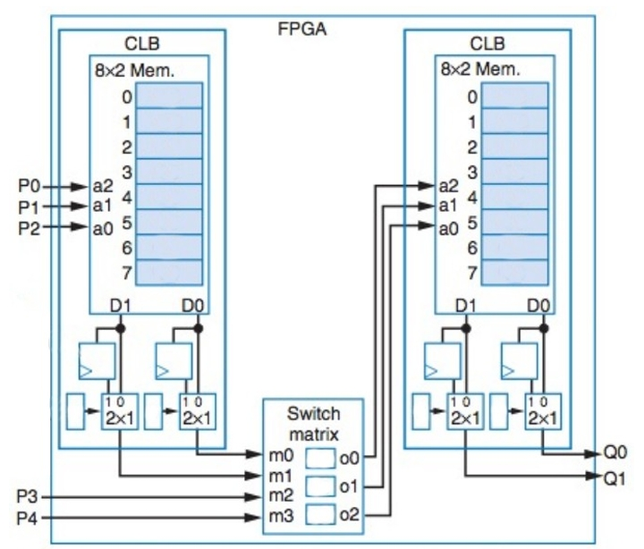
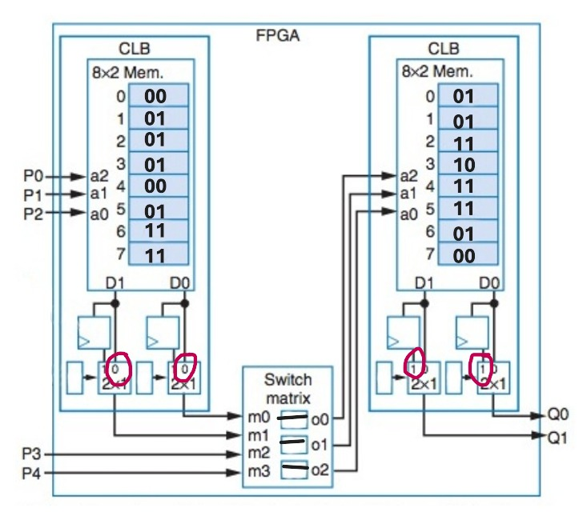

## Questão 1

Dado o FPGA abaixo, contendo **2 CLBs com LUTs 3x2**, desenhe um circuito qualquer que possa ser implementado neste FPGA e mostre como ficaria a configuração final (preencha os bits na própria figura) do FPGA para este circuito. O circuito deve obedecer às seguintes restrições:

- Deve possuir **5 entradas e 2 saídas**;
- Todas as portas lógicas utilizadas devem ter **no máximo 2 entradas**;
- A **LUT de um CLB deve conter valores diferentes** da LUT do outro CLB;
- O circuito deve usar **no mínimo 2 FFs**.

---

O circuito projetado divide a lógica entre os dois CLBs para atender a todos os requisitos.

---

### CLB Esquerdo (Lógica Combinacional)

Gera dois sinais intermediários (**m0**, **m1**) a partir das entradas **P0**, **P1**, **P2**.

- m0 = P2 AND P1  
- m1 = P1 OR P0  

---

### Matriz de Interconexão (Switch Matrix)

Roteia os sinais para o segundo CLB. As entradas para o CLB direito serão:

- a2 = m0 (saída do CLB esquerdo)  
- a1 = P3 (entrada externa)  
- a0 = P4 (entrada externa)  

---

### CLB Direito (Lógica Registrada)

Gera as saídas finais **Q0** e **Q1** usando os sinais da matriz de interconexão. As saídas são passadas por **Flip-Flops (FFs)** para cumprir a restrição de usar no mínimo 2 FFs.

- Q0 <= m0 XOR P3  
- Q1 <= P3 NAND P4  

---

## Configuração Detalhada do FPGA

### CLB Esquerdo 

**Entradas da LUT:**
* $a2 = P2$
* $a1 = P1$
* $a0 = P0$

**Funções descritas no texto:**
* $m0 = P2 \land P1$ (AND)
* $m1 = P1 \lor P0$ (OR)

**Conferência com a Tabela :**

| Endereço (P2,P1,P0) | D1 (m0) | D0 (m1) |
| :--- | :---: | :---: |
| 0 (`000`) | 0 | 0 |
| 1 (`001`) | 0 | 1 |
| 2 (`010`) | 0 | 1 |
| 3 (`011`) | 0 | 1 |
| 4 (`100`) | 0 | 0 |
| 5 (`101`) | 0 | 1 |
| 6 (`110`) | 1 | 1 |
| 7 (`111`) | 1 | 1 |

> **Análise:**
> * **$m0 = P2 \land P1$:** Só é `1` quando $P2=1$ e $P1=1$ (endereços `110` e `111`). 
> * **$m1 = P1 \lor P0$:** Bate exatamente com a coluna D0. 

✔ **Conclusão:** Conteúdo da LUT do CLB esquerdo está correto.

✔ **Mux:** Seletores do MUX em `0` (saída combinacional).

---

### 2. Switch Matrix

Conforme descrito e mostrado na figura, as conexões de roteamento são:

* $m0 \rightarrow o0$
* $P3 \rightarrow o1$
* $P4 \rightarrow o2$

Essas conexões são exatamente as que aparecem no diagrama, alimentando o CLB direito.

✔ **Conclusão:** Roteamento correto.

---

### CLB Direito

**Entradas da LUT:**
* $a2 = m0$
* $a1 = P3$
* $a0 = P4$

**Funções descritas:**
* $Q0_{próx} = m0 \oplus P3$ (XOR)
* $Q1_{próx} = \overline{P3 \land P4}$ (NAND)
* *(Nota: Com saídas registradas, seletor do MUX = 1)*

**Conferência com a Tabela :**

| Endereço (m0,P3,P4) | D1 ($Q0_{próx}$) | D0 ($Q1_{próx}$) |
| :--- | :---: | :---: |
| 0 (`000`) | 0 | 1 |
| 1 (`001`) | 0 | 1 |
| 2 (`010`) | 1 | 1 |
| 3 (`011`) | 1 | 0 |
| 4 (`100`) | 1 | 1 |
| 5 (`101`) | 1 | 1 |
| 6 (`110`) | 0 | 1 |
| 7 (`111`) | 0 | 0 |

> **Análise:**
> * **$Q0 = m0 \oplus P3$:** Confere para todos os casos (o valor muda quando as entradas são diferentes, independente de P4). 
> * **$Q1 = \overline{P3 \land P4}$:** Só é `0` quando $P3=1$ e $P4=1$ (endereços `011` e `111`). 

✔ **Conclusão:** Conteúdo da LUT do CLB direito está correto.

✔ **Mux:** Seletores do MUX em `1` (saída registrada via Flip-Flops).

---

### FPGA

