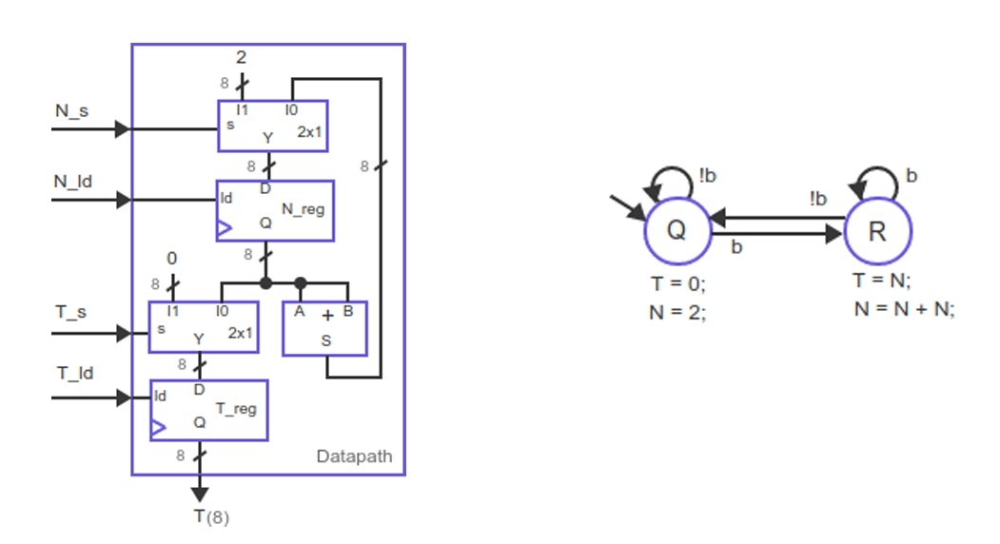
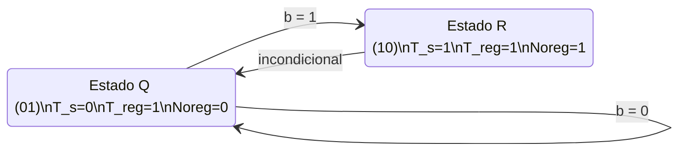

## 3) Apresente a tabela verdade e a FSM do bloco de controle

Apresente a tabela verdade e a FSM do bloco de controle (com os devidos sinais de controle e valores) correspondentes ao datapath e à FSM de alto nível abaixo. Considere a codificação “one hot”, de forma que os estados Q e R sejam codificados em 01b e 10b, respectivamente.

---

### Codificação

Estado Q = 01, Estado R = 10. (Bits de estado: p1, p0)

### Sinais de Controle

T_s, T_reg (load do registrador Y), Noreg (load do registrador N).

---

## Máquina de Estados (FSM) do Controle

### Estado Q (p1 p0 = 01)

Saídas:  
T_s = 0, T_reg = 1, Noreg = 0.

Transição:  
Se b = 0, próximo estado é Q (01).  
Se b = 1, próximo estado é R (10).

---

### Estado R (p1 p0 = 10)

Saídas:  
T_s = 1, T_reg = 1, Noreg = 1.

Transição:  
Incondicional para o estado Q (01).

---

## Diagrama de Estados

(Saídas Q: T_s = 0, T_reg = 1, Noreg = 0)  
(Saídas R: T_s = 1, T_reg = 1, Noreg = 1)

### O que esse diagrama representa
- **Estados codificados em one-hot**
  - Q = `01`
  - R = `10`
- **FSM do tipo Moore** (saídas dependem apenas do estado)
- As saídas já estão anotadas dentro de cada estado
- As transições estão rotuladas exatamente como no enunciado

---

## Tabela Verdade

| Estado Atual (p1 p0) | Entrada (b) | Próximo Estado (n1 n0) | T_s | T_reg | Noreg |
|----------------------|-------------|------------------------|-----|-------|--------|
| 0 1                  | 0           | 0 1                    | 0   | 1     | 0      |
| 0 1                  | 1           | 1 0                    | 0   | 1     | 0      |
| 1 0                  | X           | 0 1                    | 1   | 1     | 1      |
| 0 0                  | X           | X X                    | X   | X     | X      |
| 1 1                  | X           | X X                    | X   | X     | X      |

