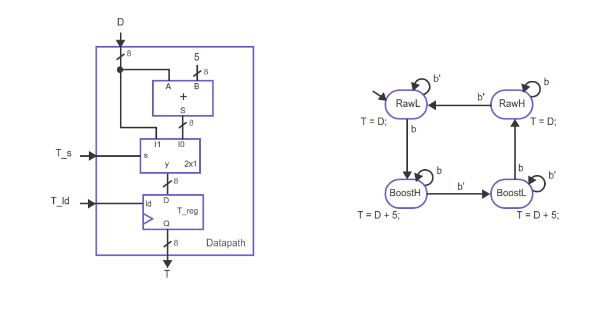

## b) Mostre a FSM do bloco de controle, com os devidos sinais de controle e valores

---

### 1) Entendimento do problema

O enunciado fornece:
- Um **datapath** com:
  - Um multiplexador controlado por **T_s**
  - Um registrador **T** com sinal de carga **T_reg**
  - Dois registradores auxiliares controlados por **BoostL_ld** e **BoostH_ld**
- Uma **FSM de alto nível**, onde o sistema alterna entre duas operações:
  - **T = D**
  - **T = T + 5**

O objetivo é descrever a **FSM do bloco de controle**, incluindo:
- Estados
- Transições
- Sinais de controle ativos em cada estado

---

### 2) Definição dos estados da FSM

A FSM possui **dois estados**, pois há duas operações distintas:

- **S0** → operação **T = D**
- **S1** → operação **T = T + 5**

Utiliza-se **codificação binária com 1 bit de estado (p0)**:
- **S0** → p0 = 0
- **S1** → p0 = 1

---

### 3) Tipo da máquina de estados

A FSM é do tipo **Moore**, pois:
- As saídas dependem **apenas do estado atual**
- Não dependem diretamente de entradas externas

Assim, cada estado define completamente os sinais de controle.

---

### 4) Estado S0 — Operação T = D

Neste estado, o objetivo é carregar diretamente o valor **D** no registrador **T**.

**Seleção do dado de entrada**
- O multiplexador deve selecionar **D**
- Portanto: **T_s = 0**

**Carga do registrador T**
- O valor selecionado deve ser armazenado
- Portanto: **T_reg = 1**

**Operação dos registradores auxiliares**
- Executa-se **BoostL = RawL**
- Portanto:
  - **BoostL_ld = 1**
  - **BoostH_ld = 0**

**Saídas no estado S0**

| Sinal        | Valor |
|--------------|-------|
| T_s          | 0     |
| T_reg        | 1     |
| BoostL_ld    | 1     |
| BoostH_ld    | 0     |

---

### 5) Estado S1 — Operação T = T + 5

Neste estado, o objetivo é somar 5 ao valor atual de **T**.

**Seleção do dado de entrada**
- O multiplexador deve selecionar a saída do somador (**T + 5**)
- Portanto: **T_s = 1**

**Carga do registrador T**
- O resultado deve ser armazenado
- Portanto: **T_reg = 1**

**Operação dos registradores auxiliares**
- Executa-se **BoostH = RawH**
- Portanto:
  - **BoostH_ld = 1**
  - **BoostL_ld = 0**

**Saídas no estado S1**

| Sinal        | Valor |
|--------------|-------|
| T_s          | 1     |
| T_reg        | 1     |
| BoostL_ld    | 0     |
| BoostH_ld    | 1     |

---

### 6) Transições entre estados

As transições são **incondicionais**, ocorrendo a cada pulso de clock:
- **S0 → S1**
- **S1 → S0**

A FSM alterna continuamente entre os dois estados.

---

### 7) Representação conceitual da FSM

    ┌──────────────┐
    │     S0       │
    │   (T = D)    │
    │ T_s = 0      │
    │ T_reg = 1    │
    │ BoostL_ld=1  │
    │ BoostH_ld=0  │
    └──────┬───────┘
           │ clock
           ▼
    ┌──────────────┐
    │     S1       │
    │  (T = T+5)   │
    │ T_s = 1      │
    │ T_reg = 1    │
    │ BoostL_ld=0  │
    │ BoostH_ld=1  │
    └──────┬───────┘
           │ clock
           └──────────► retorna a S0

---

### 8) Conclusão

O bloco de controle é composto por:
- Uma **FSM Moore de dois estados**
- Codificação binária com **1 bit**
- Transições incondicionais a cada ciclo de clock
- Sinais de controle definidos exclusivamente pelo estado atual

Essa FSM garante a execução alternada das operações **T = D** e **T = T + 5**, controlando corretamente o datapath apresentado.
