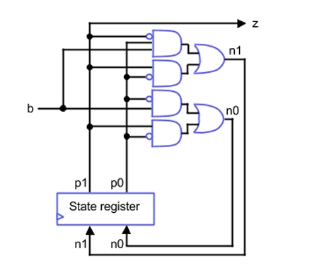

## 5) Dado um FPGA onde os CLBs possuem LUTs 3x1 e matrizes de interconexão com 4 entradas e 4 saídas, mostre como ficaria a configuração do circuito do bloco de controle mostrado a seguir. Utilize quantos CLBs e matrizes quiser e faça as ligações entre os componentes da forma que  achar necessário.

---
### 1) Uso de CLBs e LUTs

O circuito precisa calcular duas saídas, **n1** e **n0**, e ambas dependem das mesmas três entradas: **b**, **p1** e **p0**.  

Como cada CLB do FPGA possui uma **LUT 3×1**, capaz de implementar qualquer função booleana de três variáveis, é suficiente utilizar:
- **1 CLB** para implementar a função de **n1**
- **1 CLB** para implementar a função de **n0**

Essa escolha é adequada e eficiente, já que cada saída depende exatamente de três entradas.

---

### 2) Verificação da função lógica de `n1`

#### Equação lógica

A equação proposta para **n1** é:

