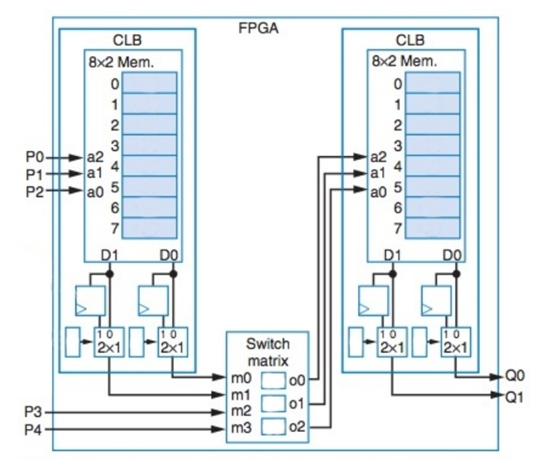

## 6) Cálculo do tempo e da frequência dos caminhos

Calcule o tempo e a frequência do maior e do menor caminho de cada um dos circuitos das questões anteriores (incluindo o datapath da questão 1). Considere que todas as portas lógicas possuem **1 ns** de atraso e que cada componente do datapath possui **3 ns** de atraso. Ignore o tempo dos fios.

## Datapath da questão 1

---

### Tabela resumo dos caminhos

| Circuito | Caminho Máximo (Crítico) | T_max | f_max | Caminho Mínimo | T_min | f_min |
|---------|---------------------------|-------|-------|----------------|-------|-------|
| **Q1 (Datapath)** | P0/P1/P2 → LUT1 → LUT2 → FF | 3 ns + 3 ns = **6 ns** | **166,7 MHz** | P3/P4 → LUT2 → FF | **3 ns** | **333,3 MHz** |
| **Q3 (Datapath)** | A/B → Somador → MUX → Reg_Y | 3 ns + 3 ns = **6 ns** | **166,7 MHz** | N_reg → MUX → Reg_Y | **3 ns** | **333,3 MHz** |
| **Q4 (Datapath)** | T_reg → Somador → MUX → Reg_T | 3 ns + 3 ns = **6 ns** | **166,7 MHz** | D → MUX → Reg_T | **3 ns** | **333,3 MHz** |
| **Q5 (Controle)** | p0/p1 → NOT → AND → OR → n0 | 1 ns + 1 ns + 1 ns = **3 ns** | **333,3 MHz** | p0/p1 → AND → OR → n1 | **2 ns** | **500 MHz** |

---

### Observações

- O **caminho crítico** é sempre o de maior atraso, pois ele limita a frequência máxima de operação do circuito.
- A frequência máxima é calculada por:  
  **f_max = 1 / T_max**
- Da mesma forma, a frequência associada ao menor caminho é:  
  **f_min = 1 / T_min**
- Nos datapaths (Q1, Q3 e Q4), o caminho crítico envolve sempre **dois componentes do datapath**, totalizando **6 ns**.
- No circuito de controle (Q5), o caminho crítico passa por **três portas lógicas**, resultando em **3 ns** de atraso.

---

### Conclusão

- Os **datapaths** apresentam frequência máxima de aproximadamente **166,7 MHz**.
- O **bloco de controle** é mais rápido, alcançando até **333,3 MHz** no caminho crítico.
- Os caminhos mínimos permitem frequências maiores, mas não determinam o limite global do sistema.
